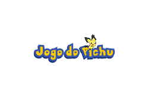

# Jogo do Pichu
Projeto com fins educacionais desenvolvido durante a disciplina de Laboratório de Produção de Software, ministrada pelo professor Ronem Lavareda no IFAM Parintins, com o objetivo de desenvolver um jogo do bicho.

# Tecnologias Escolhidas
- Angular (Frontend)
- Spring Boot (Backend)

# API/Frameworks utilizados
- Bootstrap (https://getbootstrap.com/docs/5.3)
- PokerAPI (https://pokeapi.co/about)

# link do projeto no Figma
- https://www.figma.com/design/88e1eQfMGgbBbAZTWeUenJ/Jogo-do-Pichu?node-id=18-79&t=ZAOJgHpxVcwcUsDJ-1
